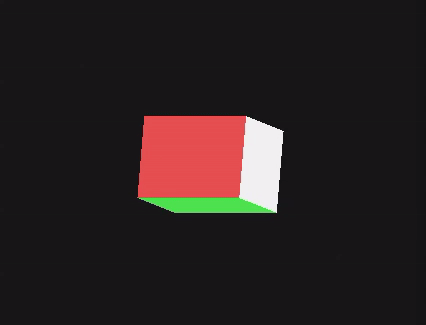

# Anvil Engine
Anvil Engine is my life long software project that i use to **study and learn** computer graphics. i figured the best way to do that was creating a game engine. so far, its under heavy development and can barely render anything lol. but by may i lan to have most of the core features done. 

# Updates

**Anvil now supports both Mac and Windows!**

***Working On:***
 - [x] properly added submodules
 - [x] port to windows
 - [x] updated include paths 
 - [ ] [current] refactoring/rewriting renderer
 - [ ] abstract into a DLL for a core/app architecture 

