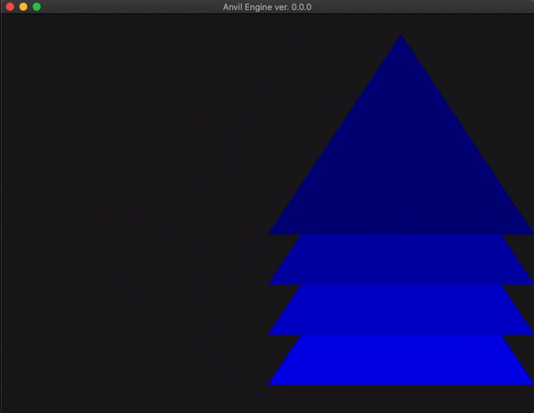

# Anvil Engine
Anvil Engine is my life long software project that i use to **study and learn** computer graphics. i figured the best way to do that was creating a game engine. so far, its under heavy development and can barely render anything lol. but by may i lan to have most of the core features done. 

# Updates

***Working On:***
 these changes will help with the porting process and compatibility with  Visual Studio
 - [x] properly added submodules
 - [ ] ~[current]~ refactoring 
 - [ ] updated include paths 
 - [ ] **migrate to CMake**

***Next Plan: Port to Windows!***